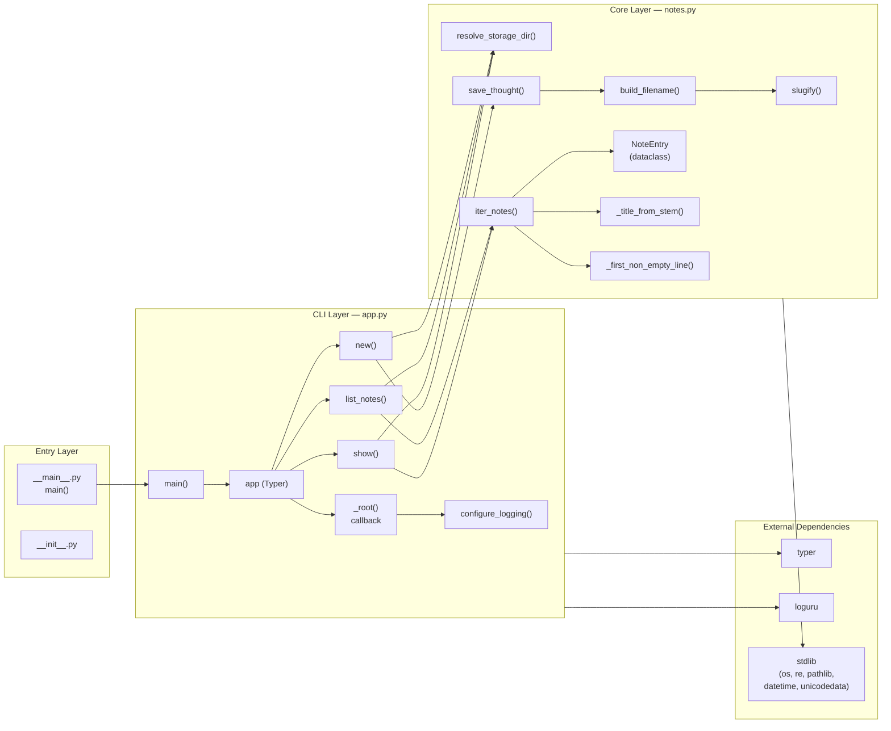
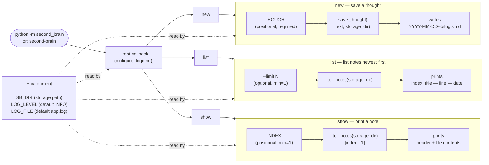

# Architecture Diagrams

Three Mermaid flowcharts describing the `second_brain` package:
its module layout, its CLI entry points, and a typical user flow.

## 1. Package Overview

How modules, functions, and external dependencies connect.

---

## 2. CLI Entry Points

The arguments and options accepted by each subcommand, and the
code path invoked behind each.

---

## 3. Example User Flow

A typical capture → browse → read session.

```mermaid
flowchart LR
    Start(["User opens terminal"]) --> Cap["second-brain new<br/>'idea for onboarding flow'"]

    Cap --> Resolve1["resolve_storage_dir()<br/>reads SB_DIR"]
    Resolve1 --> Save["save_thought()"]
    Save --> Slug["slugify + build_filename"]
    Slug --> Collide{"file<br/>exists?"}
    Collide -- no --> Write["write .md to disk"]
    Collide -- yes --> Bump["append -2, -3, ..."] --> Write
    Write --> Echo1(["echo: Saved: /path/...md"])

    Echo1 --> Browse["second-brain list --limit 5"]
    Browse --> Resolve2["resolve_storage_dir()"]
    Resolve2 --> Iter["iter_notes()"]
    Iter --> Sort["sort by mtime<br/>(newest first)"]
    Sort --> Render(["echo each:<br/>idx. title — line — date"])

    Render --> Pick["user picks index 1"]
    Pick --> ShowCmd["second-brain show 1"]
    ShowCmd --> Iter2["iter_notes()"]
    Iter2 --> Range{"index<br/>in range?"}
    Range -- no --> Err(["stderr + exit 1"])
    Range -- yes --> Print(["echo header + file contents"])

    Print --> End(["User reads the note"])
```

